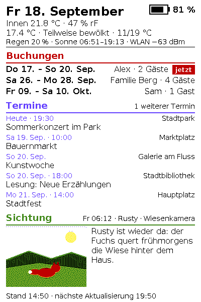
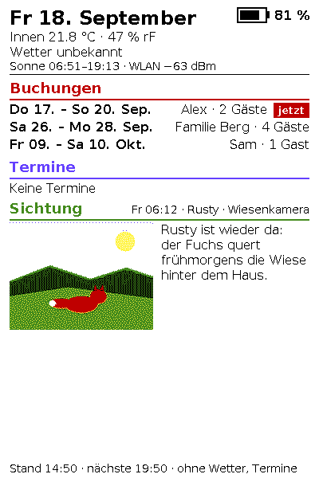
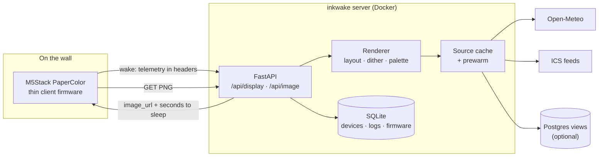

# inkwake — a colour e-ink dashboard that is switched off most of the day

inkwake drives an **M5Stack PaperColor** (4" Spectra 6 colour e-ink, ESP32-S3) as
a wall dashboard. Three times a day the board switches itself on, fetches a
finished frame from a small server, paints it and cuts its own power again.
Between wakes it draws about 92 µA, so one charge lasts months rather than days.

<p align="center">
  
  &nbsp;&nbsp;
  
</p>

<sub>Rendered by `scripts/render_examples.py` from made-up data, pixel for pixel
what the board receives. Right: two sources down — the frame keeps the rest and
says so in the footer.</sub>

## Why

Colour e-ink is lovely on a wall and awkward everywhere else. The panel needs
15–30 s per refresh, takes permanent damage if refreshed more often than every
180 s, gets burn-in if it is *not* refreshed for a day, and shows colour casts
below ~15 °C. The board's ESP32 deep sleep still draws 5–10 mA because the rails
stay up. And quantising a picture onto six inks properly (Lab colour matching
against *measured* panel colours plus error diffusion) is far too much work for
a microcontroller on every wake.

inkwake takes all of that off the device: the board is a **thin client** that
fetches a PNG and blits it, the PMIC switches it fully off between wakes, and the
server enforces the panel-care rules, does the colour science and tells the board
how long to sleep.

## Features

- **Thin client over [TRMNL BYOS](https://docs.trmnl.com/go/diy/byos)**: the
  board holds no fonts, no time zone and no layout. Telemetry (battery,
  temperature, humidity, RSSI) travels in request headers and is rendered into
  the very frame returned in the same response.
- **Real power-off between wakes** via the M5PM1 PMIC (≈92 µA instead of 5–10 mA),
  with a read-back check that the wake timer is really armed.
- **Panel care enforced on the server**: ≥180 s between refreshes, at least one
  refresh per day, no refresh below a configurable temperature — per device.
- **Six-ink colour pipeline**: Lab matching against measured panel colours,
  error diffusion for photos, and a palette trick that makes the board's own
  re-quantisation a no-op. Every frame is checked for stray colours before it
  leaves the server.
- **Content sources**
  - weather (Open-Meteo, no key) and locally computed sunrise/sunset,
  - events from any number of **iCalendar (ICS) feeds**, with recurrence rules,
    exceptions and de-duplication across calendars,
  - optional **bookings** and **wildlife-camera sightings** from two Postgres
    views you define (see [docs/data-sources.md](docs/data-sources.md)).
- **Degrades instead of failing**: a dead source costs its panel, never the
  frame; the footer names what is stale. Sources are pre-warmed shortly before
  each wake so the board's radio is not kept waiting.
- **Device registry in SQLite**, managed with a small CLI. Devices authenticate
  with a per-device token that is shown once; only its SHA-256 is stored.
- **Over-the-air updates** for registered firmware images, held back while the
  reported charge is below a per-device threshold and never offered in the same
  wake as a repaint.

## Architecture



A wake is two requests: `GET /api/display` (authenticated, carries telemetry,
answers with an image URL and a sleep countdown in seconds) and the image
download, which honours `If-None-Match` so an unchanged frame costs a 304 and no
refresh. The board never learns the time of day — daylight saving time exists
only on the server.

## Quick start

You need Docker with Compose on a machine the board can reach.

```bash
git clone https://github.com/Juice-de-Orange/inkwake.git
cd inkwake
cp .env.example .env            # set PUBLIC_BASE_URL: the address the BOARD reaches the server at,
                                # e.g. http://192.168.1.20:8099 on a LAN without a domain --
                                # and then INKWAKE_BIND=0.0.0.0 as well (see below)
docker compose up -d --build
docker compose exec inkwake python -m app.cli device add --label "Hallway"
```

`device add` prints the device token **once**. Then flash the board and enter
your Wi-Fi, the server URL and the token in its setup portal — see
[firmware/README.md](firmware/README.md). Without hardware, set `ADMIN_API_KEY`
and open `/preview` with the header `X-Admin-Key` to see a live frame.

The compose file binds the port to `127.0.0.1:8099`, for a reverse proxy that
terminates TLS (the firmware verifies certificates against the ESP-IDF CA
bundle, so use a publicly trusted certificate). **Without a reverse proxy, on a
trusted LAN, set `INKWAKE_BIND=0.0.0.0` in `.env`** — with the default the
server answers only on the host itself and the board gets "connection refused".
Deployment details, the reverse proxy, backups and restore:
[docs/deploy.md](docs/deploy.md).

## Operating it

```bash
docker compose exec inkwake python -m app.cli device list
docker compose exec inkwake python -m app.cli device set <id> --slots 06:50,14:50,19:50
docker compose exec inkwake python -m app.cli device set <id> --min-refresh-temp-c 12

# Over-the-air update. The CLI runs inside the container, so the image has to get there first:
docker compose exec -T inkwake sh -c 'cat > /tmp/firmware.bin' < firmware/.pio/build/papercolor/firmware.bin
docker compose exec inkwake python -m app.cli firmware add /tmp/firmware.bin --version 1.0.1
docker compose exec inkwake python -m app.cli device set <id> --firmware <firmware-id>
```

`firmware add` refuses a file that is not a complete inkwake image for this
board, or whose compiled-in version differs from `--version`; the details are in
[docs/deploy.md](docs/deploy.md#5-over-the-air-firmware-updates).

Wake times are the biggest battery lever there is: each daily slot costs roughly
430 mAh a year, more than every firmware optimisation combined. The defaults
(06:50, 14:50, 19:50) are a starting point, not a recommendation.

## Tech stack

| Part | Stack |
|---|---|
| Server | Python 3.13, FastAPI, uvicorn, Pillow, NumPy, icalendar, psycopg (optional source) |
| Storage | SQLite (device registry, logs, firmware catalogue), files in one Docker volume |
| Firmware | C++ / Arduino on ESP32-S3 via PlatformIO, M5Unified, M5GFX, WiFiManager |
| Hardware | M5Stack PaperColor (C151): 400×600 Spectra 6, M5PM1 PMIC, SHT40, 1250 mAh |
| Quality | pytest (randomised order), ruff, gitleaks, CodeQL |

## Documentation

| Document | What it is for |
|---|---|
| [HARDWARE.md](HARDWARE.md) | Technical reference for the board, with every claim marked verified, derived or unverified. Nearly every design decision here traces back to it. |
| [firmware/README.md](firmware/README.md) | Building, flashing, first setup, reading the serial log, and what is still unverified on hardware. |
| [docs/ARCHITECTURE.md](docs/ARCHITECTURE.md) | A wake end to end, and a map of the server and firmware modules. |
| [docs/deploy.md](docs/deploy.md) | Running the server: compose, reverse proxy, backups, updates. |
| [docs/data-sources.md](docs/data-sources.md) | The ICS source and the two optional Postgres views, with example SQL. |
| [docs/DEVELOPMENT.md](docs/DEVELOPMENT.md) | Local setup, tests, layout work without hardware. |
| [CLAUDE.md](CLAUDE.md) | The design rules and traps, written for anyone (human or agent) changing the code. |

## Status & roadmap

The server has been verified against real data, and the firmware has run end to
end on real hardware (Wi-Fi, plan, image, refresh, wake timer). Not yet proven on
hardware: an over-the-air update and the in-wake TLS/timeout guards under real
failures — see *Known gaps* in [firmware/README.md](firmware/README.md).

The panel text is German (weekday names, headings, the setup screens). Section
headings are configurable; full localisation is an open issue. Other open ideas
are tracked as [issues](https://github.com/Juice-de-Orange/inkwake/issues).

## Contributing

Issues and pull requests are welcome — see [CONTRIBUTING.md](CONTRIBUTING.md).
Issues labelled `good first issue` are a good place to start. Please report
security problems privately, as described in [SECURITY.md](SECURITY.md).

## Built with Claude Code

Most of inkwake was written in pair-programming sessions with
[Claude Code](https://claude.com/claude-code), Anthropic's coding agent: research
into the hardware, implementation, tests and audits. Architecture, review and
release decisions are the maintainer's. [`CLAUDE.md`](CLAUDE.md) is the working
agreement the agent follows in this repository.

## License

[MIT](LICENSE) © Max Oberrauch. The bundled DejaVu fonts are under their own
free licence, see [assets/fonts/LICENSE](assets/fonts/LICENSE).
