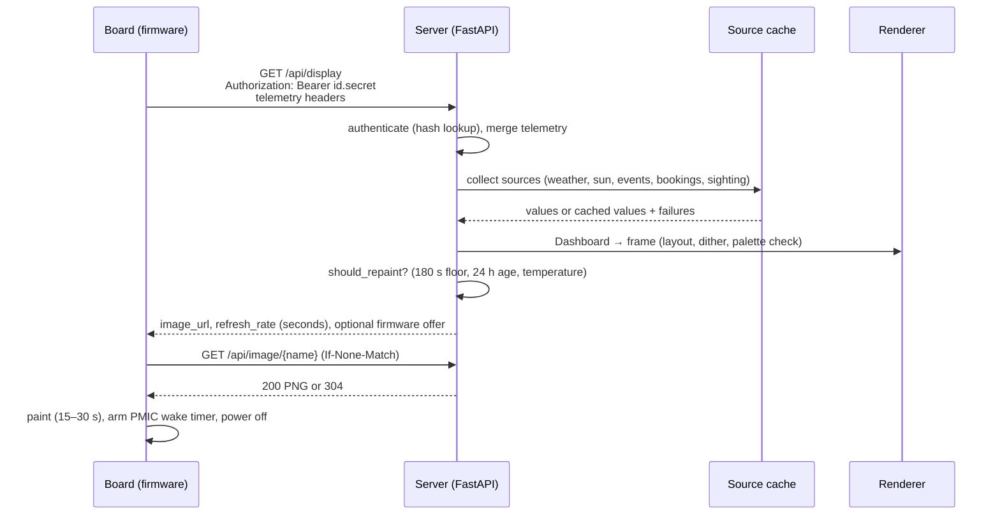

# Architecture

inkwake is a server that renders complete frames and a firmware that only
displays them. The reasons for that split, and the traps each part avoids, are in
[CLAUDE.md](../CLAUDE.md); this page is the map.

## A wake, end to end

## Server modules

| Module | Responsibility |
|---|---|
| `app/main.py` | FastAPI app: endpoints, authentication flow, repaint decision, battery gate, firmware offer, prewarm loop, frame store |
| `app/auth.py` | Device token parsing and constant-time verification (401 vs 403 vs 503) |
| `app/store.py` | SQLite schema and statements: devices, device logs, firmware catalogue |
| `app/cli.py` | Operator commands (`python -m app.cli`) |
| `app/firmware_image.py` | The checks that make a file an inkwake firmware image; shared by `firmware add` and `firmware/tools/verify-image.py` |
| `app/assemble.py` | Runs the sources concurrently under a time budget, caches results, turns failures into footer hints |
| `app/schedule.py` | Wake slots, countdowns across DST, `should_repaint` |
| `app/models.py` | The data contracts between sources and renderer |
| `app/config.py` | Settings from the environment |
| `app/sources/` | `weather` (Open-Meteo), `sun` (NOAA, local), `events` (ICS), `database` (Postgres views) |
| `app/render/layout.py` | The frame layout, including the space bidding between events and photo |
| `app/render/dither.py` | Photo dithering onto the six inks |
| `app/render/palette.py` | Measured vs device colours, the palette check |
| `app/render/encode.py` | PNG and packed 4 bpp output |

## Firmware modules

| File | Responsibility |
|---|---|
| `firmware/src/main.cpp` | The wake state machine, watchdog, notice screens |
| `firmware/src/net.cpp` | Wi-Fi, setup portal, HTTP(S) with bounded transfers, OTA |
| `firmware/src/panel.cpp` | Drawing the received image and the notice screens |
| `firmware/src/power.cpp` | PMIC: battery, wake timer with read-back, power-off |
| `firmware/src/store.cpp` | NVS: token, server URL, ETag, counters |
| `firmware/src/config.h` | Every timing and threshold constant, with its derivation |

## State

Everything the server keeps lives under `DATA_DIR` (one Docker volume):
`inkwake.sqlite3` (registry, logs, firmware catalogue), `frames/` (rendered PNGs),
`firmware/` (registered OTA images) and the per-feed calendar cache. The board
keeps its token, server URL, ETag and failure counters in NVS and survives
nothing else between wakes — it cold-boots every time.
